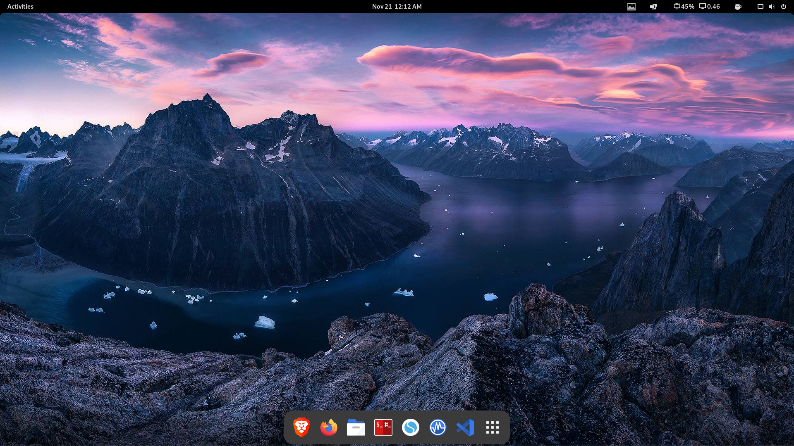

# VictoryArchLite.

# A WORK IN PROGRESS...not there yet.



This README contains the steps I do to configure a fully-functional Arch Linux installation containing Gnome desktop environment, all the support packages (network, bluetooth, audio, printers, etc.), along with all my preferred applications and utilities. The shell scripts in this repo allow the entire process to be automated.)

---
## Create Arch ISO or Use Image

Download ArchISO from <https://archlinux.org/download/> and put on a USB drive with Ventoy or Popsicle

## Boot Arch ISO

Install Arch Linux using Archfi script or an installer of you choice
https://github.com/MatMoul/archfi

choose Gnome DE and a basic setup.

after install, boot into Gnome DE. Open a terminal and run the following command:

```
pacman -Sy git
git clone https://github.com/VictoryLinux/VictoryArchLite
cd VictoryArch
./victoryarchlite.sh

restart
```

### System Description
This is completely automated arch install of the Gnome desktop environment on arch using all the packages I use on a daily basis. 
